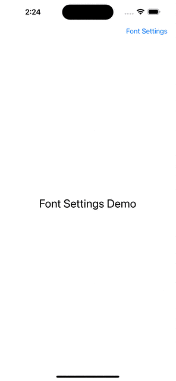
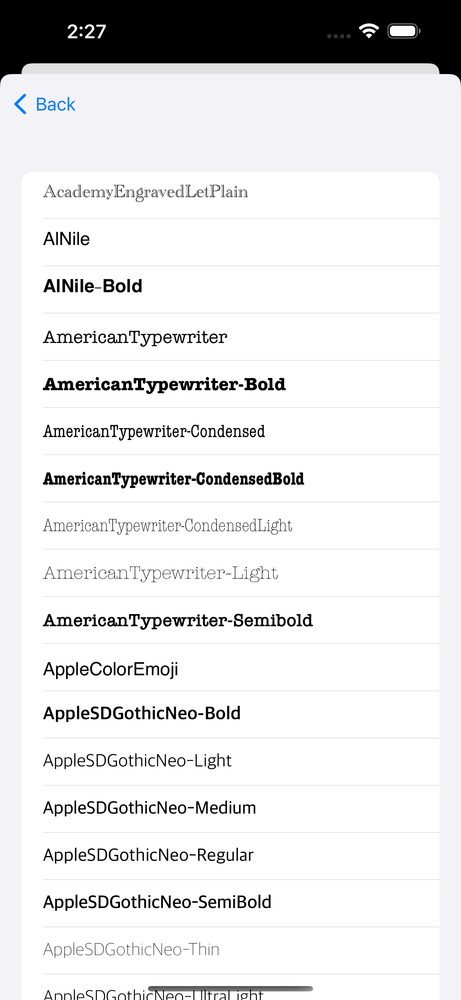
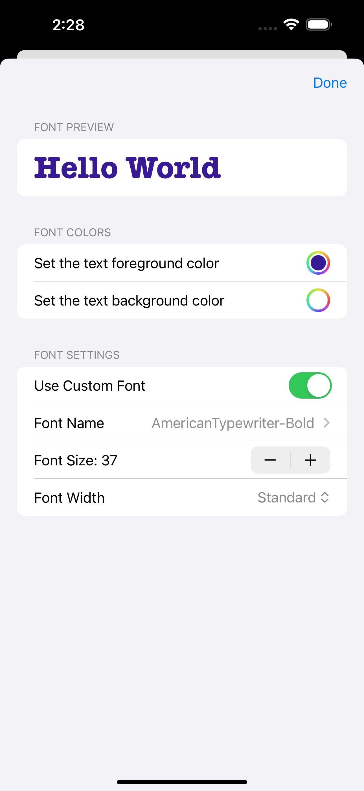

<p align="center">
    
</p>

# SwiftUIFontSettingsView

SwiftUIFontSettingsView is a simple but highly customizable SwiftUI view that allows you to effortlessly configure font settings for your iOS applications. With this open-source library, you can easily adjust font color, font name, font style, and font size, providing a seamless user experience for your app's typography.

## Features

- **Color Customization**: Change the font color to match your app's branding or user preferences.
- **Font Name Selection**: Choose from a wide range of font families to find the perfect typographic style for your application.  
- **Font Style Configuration**: Easily toggle between different font styles, such as bold, italic, or regular, to create visually appealing text elements.
- **Font Size Adjustment**: Provide users with the ability to increase or decrease the font size according to their reading preferences or accessibility needs.
- **Intuitive User Interface**: SwiftUIFontSettingsView offers a sleek and user-friendly interface, making it easy for users to explore and customize font settings.

## Requirements
* iOS 16.1+

## Install
 ### Swift Packages
* Repository: https://github.com/guoyingtao/SwiftUIFontSettings.git
* Rules: Version - Exact - 1.0.0

## Usage

```Swift
@State private var fontSettings: FontSettings = FontSettings()
...
FontSettingsView(fontSettings: $fontSettings)

...

FontSettingsView(fontSettings: $fontSettings, showExtraTopContent: true, topContentBuilder:  {
    // some view here
})

...
FontSettingsView(fontSettings: $fontSettings, showExtraBottomContent: true, bottomContentBuilder:  {
    // some view here
})
```

## Demos
<p align="center">
     
     
     
</p>

## License
SwiftUIFontSettingsView is released under the MIT License.

## Credit
<a href="https://www.flaticon.com/free-icons/font" title="font icons">Font icons created by Vector Clans - Flaticon</a>
